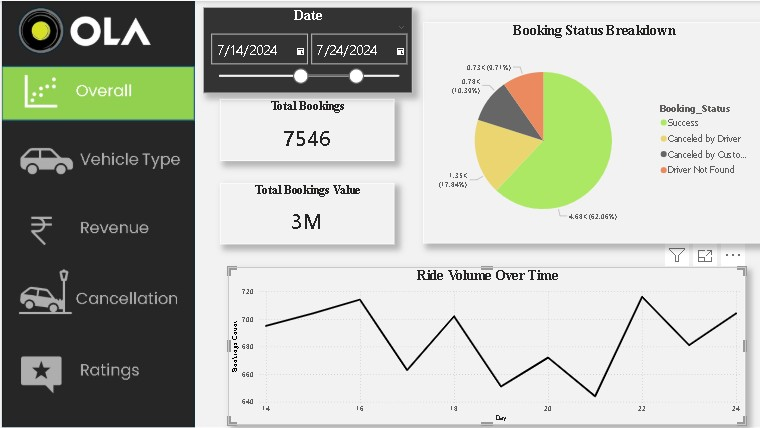
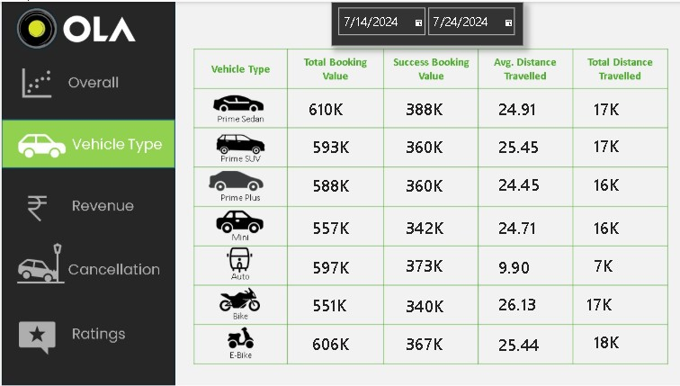
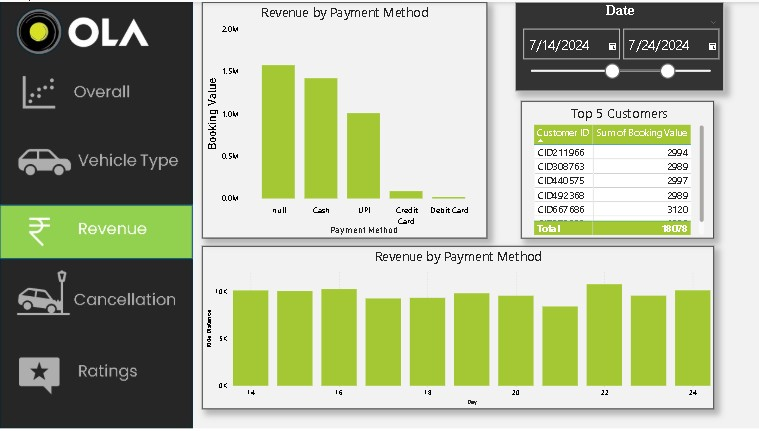
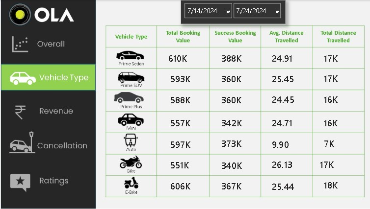
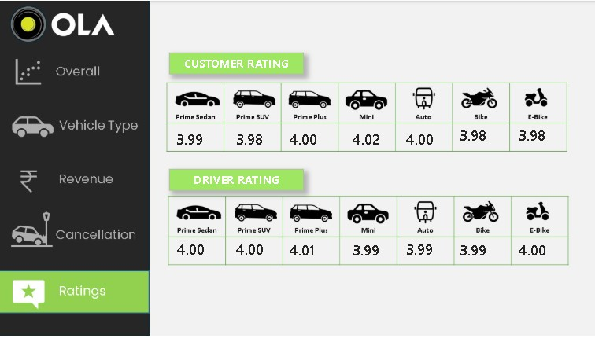

**🚖 OLA Dashboard Analysis
**
An interactive and visually engaging OLA Dashboard Presentation designed to analyze booking performance, vehicle trends, revenue insights, cancellations, and customer ratings.
This dashboard provides a data-driven overview of ride statistics using clean visualizations and KPI metrics.

**📌 Project Overview**

The OLA Dashboard project consists of 5 analytical slides/pages created to monitor and evaluate operational performance across different vehicle categories.

The dashboard helps in:
Tracking booking performance
Comparing vehicle categories
Monitoring revenue insights
Understanding cancellation trends
Analyzing customer ratings

**🖼️ Dashboard Slides**

**1️⃣ Overall**

**This slide presents detailed insights into different vehicle categories available on the platform.**

**Included Metrics:**
Total Booking Value
Successful Booking Value
Average Distance Travelled
Total Distance Travelled
Vehicle Categories:
Prime Sedan
Prime SUV
Prime Plus
Mini
Auto
Bike
E-Bike

**2️⃣ Vehicle Type**

The Vehicle Type Dashboard provides a comparative analysis of different ride categories available on the OLA platform.
This slide helps identify booking performance, travel patterns, and operational efficiency across vehicle types.

The Vehicle Type Dashboard provides a comparative analysis of different ride categories available on the OLA platform.
This slide helps identify booking performance, travel patterns, and operational efficiency across vehicle types.

**📊 Metrics Included**
Total Booking Value → Total ride bookings generated by each vehicle category.
Successful Booking Value → Successfully completed bookings.
Average Distance Travelled → Average ride distance per booking.
Total Distance Travelled → Overall distance covered by each vehicle category.

**🚘 Vehicle Categories Analyzed**

Prime Sedan
Prime SUV
Prime Plus
Mini
Auto
Bike
E-Bike

**🎯 Purpose of This Dashboard**

This dashboard helps:
Compare vehicle-wise business performance
Analyze customer travel behavior
Monitor ride efficiency
Support operational decision-making
Improve fleet management strategies

**🛠️ Features**
Interactive vehicle analysis
Date range filtering
KPI-focused visualization
Clean and user-friendly dashboard layout
Comparative performance tracking

**3️⃣ Revenue Dashboard**

**4️⃣ Ratings Dashboard**

**5️⃣ Rating**

Expected Insights:
Combined business overview
KPI summary
Final recommendations
Growth analysis

**✨ Features**
Interactive dashboard design
Clean and modern UI
Data-driven insights
Vehicle-wise performance analysis
KPI-focused reporting
Easy navigation between slides
🛠️ Tools & Technologies
Power BI / Tableau / Excel (update as applicable)
Data Visualization Techniques
Dashboard Design Principles

Vehicle Type Dashboard

**📊 Business Insights**
Prime category vehicles generate higher booking value.
Two-wheelers contribute significantly to total travel distance.
Successful bookings remain consistent across premium categories.
Average travel distance varies significantly by vehicle type.

**🔮 Future Enhancements**
Real-time data integration
Advanced filters
Mobile-responsive dashboard
Predictive analytics
User behavior tracking

**Sehrish**

**GitHub: (https://github.com/SehrishSabir/)**

